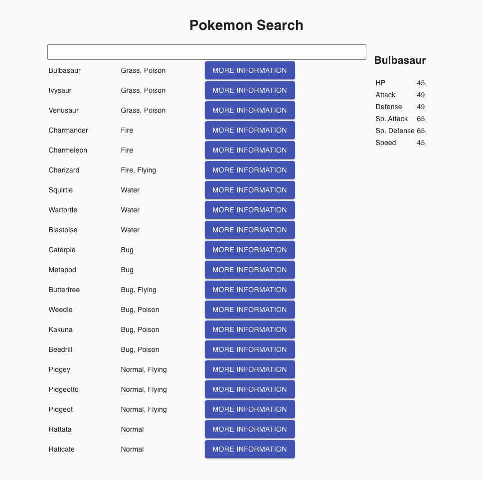

# JackHerrington-IntroToReact-ReactJSNextJSReduxZustandMobX-20200907

> *🧩 Jack Herrington - Introduction to React (Sep 7, 2020)*

> *Playlist Link: https://www.youtube.com/playlist?list=PLIvCYh5AD3Hzgj9YE4G2QH5dnKjNOJ_HC*

>*Code: https://github.com/jherr/intro-to-react-by-day*

> *Description: An introductory course for getting started with the React view framework.*

---

## Course Contents
1. 11:35 Introduction to React #1 | Deployment
1. 6:57 Introduction To React #2 | JSX
1. 6:48 Introduction To React #3 | Lists
1. 4:39 Introduction to React #4 | Creating Components
1. 10:34 Introduction to React #5 | State and Events
1. 4:57 Introduction to React #6 | Asynchronous Requests
1. 6:08 Introduction to React #7 | CSS in JS
1. 4:36 Introduction to React #8 | Component Libraries
1. 7:21 Introduction to React #9 | Class Components
1. 15:02 Introduction to React #10 | Use Context
1. 9:23 Introduction to React #11 | useReducer
1. 7:39 Introduction to React #12 | Redux
1. 8:12 Introduction to React #13 | Zustand
1. 11:51 Introduction to React #14 | MobX
1. 13:01 Introduction to React #15 | NextJS
1. 7:48 Introduction to React #16 | Server Side Rendering (SSR)
1. 8:47 Introduction To React #17 | Static Site Generation (SSG)
